# Multi-Agent Workflow

This document describes the orchestration workflow for planning and delegating work across multiple Claude agents. A **Primary Agent** is responsible for breaking projects into atomic tasks, managing a persistent task dependency tree, and spawning **Task Agents** to shepherd individual Pull Requests from implementation through to merge. The **Human** is involved at key decision points — approving plans, reviewing diffs, and providing direction when issues arise.

```mermaid
sequenceDiagram
    participant Human as Human
    participant PrimaryAgent as Primary Claude Agent
    participant PlanStorage as Plan Storage
    participant TaskAgent as Task Agent
    participant Worktree as Agent Worktree
    participant PR as Pull Request (Draft → Ready)
    participant GitHubCI as GitHub / CI
    participant LocalMain as Local Main
    participant OriginMain as Origin Main

    Note over TaskAgent: Each Task Agent is responsible for shepherding<br/>a single Pull Request from implementation through to merge

    rect rgb(30, 30, 60)
        Note over Human,PrimaryAgent: Planning Phase — may occur at any time for new or existing projects
        Human->>PrimaryAgent: Assign projects / tasks
        Note over Human,PrimaryAgent: Human may send new commands or tasks to Primary Agent at any time
        PrimaryAgent->>PlanStorage: Load existing plans and task dependency trees
        PlanStorage-->>PrimaryAgent: Return stored plans (if any)
        PrimaryAgent->>PrimaryAgent: Break work into atomic tasks
        PrimaryAgent->>PrimaryAgent: Identify task dependencies and potential worktree conflicts
        PrimaryAgent->>PrimaryAgent: Build full task dependency tree
        PrimaryAgent->>Human: Present task dependency tree for approval
        Human->>PrimaryAgent: Approve or revise task dependency tree
        PrimaryAgent->>PlanStorage: Persist approved task dependency tree
    end

    loop For each batch of tasks ready to execute per dependency tree
        PrimaryAgent->>Human: Request approval to spawn Task Agents for ready tasks
        Human->>PrimaryAgent: Approve Task Agent spawning
        PrimaryAgent->>TaskAgent: Spawn Task Agent with assigned task and worktree
        Note over PrimaryAgent,TaskAgent: Tasks with unresolved dependencies or worktree conflicts remain deferred in the tree

        break Task Agent becomes unresponsive at any point
            PrimaryAgent->>PrimaryAgent: Detect unresponsive Task Agent
            PrimaryAgent->>Human: Notify Task Agent failure for task
            alt Restart Task Agent
                Human->>PrimaryAgent: Instruct restart
                PrimaryAgent->>TaskAgent: Restart Task Agent
            else Abandon task
                Human->>PrimaryAgent: Instruct abandonment
                PrimaryAgent->>PR: Close pull request (if open)
                PrimaryAgent->>Worktree: Remove task worktree
                PrimaryAgent->>PrimaryAgent: Mark task as failed in dependency tree
                PrimaryAgent->>PrimaryAgent: Flag dependent tasks as blocked
                PrimaryAgent->>PlanStorage: Update dependency tree (task failed, dependents blocked)
                PrimaryAgent->>Human: Notify dependent tasks blocked — revise dependency tree
            end
        end

        break Human cancels task at any point
            Human->>PrimaryAgent: Cancel task
            PrimaryAgent->>PR: Close pull request (if open)
            PrimaryAgent->>Worktree: Remove task worktree
            PrimaryAgent->>PrimaryAgent: Mark task as cancelled in dependency tree
            PrimaryAgent->>PrimaryAgent: Flag dependent tasks as blocked
            PrimaryAgent->>PlanStorage: Update dependency tree (task cancelled, dependents blocked)
            PrimaryAgent->>Human: Notify dependent tasks blocked — revise dependency tree
        end

        TaskAgent->>Worktree: Create worktree and implement initial changes
        opt Task Agent discovers scope is larger than planned
            TaskAgent->>PrimaryAgent: Notify task scope exceeds original plan
            PrimaryAgent->>Human: Notify task needs re-planning
            PrimaryAgent->>PlanStorage: Load current dependency tree
            PlanStorage-->>PrimaryAgent: Return current dependency tree
            PrimaryAgent->>PrimaryAgent: Split task and update dependency tree
            PrimaryAgent->>Human: Present revised task dependency tree for approval
            Human->>PrimaryAgent: Approve or revise
            PrimaryAgent->>PlanStorage: Persist revised dependency tree
        end
        TaskAgent->>PrimaryAgent: Request approval to open PR
        loop Until human approves
            PrimaryAgent->>PrimaryAgent: Open tmux pane "review-{task}" showing full diff
            PrimaryAgent->>Human: Present full diff for review
            alt Human approves
                Human->>PrimaryAgent: Approval granted
                PrimaryAgent->>PrimaryAgent: Close tmux pane
                PrimaryAgent-->>TaskAgent: Approval granted
            else Human rejects with reason
                Human->>PrimaryAgent: Rejection with specific reason
                PrimaryAgent->>PrimaryAgent: Close tmux pane
                PrimaryAgent-->>TaskAgent: Forward rejection reason as change requests
                TaskAgent->>Worktree: Apply requested changes
                TaskAgent->>PrimaryAgent: Request approval to open PR
            end
        end

        TaskAgent->>PR: Open draft pull request
        PR->>PrimaryAgent: Notify PR opened (include URL)
        PR-->>GitHubCI: Trigger CI checks on draft

        alt CI checks fail
            GitHubCI-->>PR: Report CI failures
            PR-->>TaskAgent: Notify CI failures
            TaskAgent->>PR: Fix issues and push updates (no approval needed)
            PR-->>GitHubCI: Re-run CI checks
        else CI checks pass
            GitHubCI-->>PR: Report CI success
            TaskAgent->>PR: Mark as Ready for Review
            PR->>PrimaryAgent: Notify PR marked Ready for Review
        end

        loop Monitor review and CI feedback
            GitHubCI-->>PR: Send review comments / CI feedback
            alt Clear change requests
                PR-->>TaskAgent: Notify changes requested
                TaskAgent->>Worktree: Apply requested modifications
                TaskAgent->>PrimaryAgent: Notify updated change for approval
                loop Until human approves
                    PrimaryAgent->>PrimaryAgent: Open tmux pane "review-update-{task}" showing full diff
                    PrimaryAgent->>Human: Present full diff for review
                    alt Human approves
                        Human->>PrimaryAgent: Approval granted
                        PrimaryAgent->>PrimaryAgent: Close tmux pane
                        PrimaryAgent-->>TaskAgent: Approves updated change
                        TaskAgent->>PR: Push approved change
                        PR-->>GitHubCI: Trigger CI checks
                        alt CI checks fail
                            GitHubCI-->>PR: Report CI failures
                            PR-->>TaskAgent: Notify CI failures
                            TaskAgent->>PR: Fix issues and push updates (no approval needed)
                            PR-->>GitHubCI: Re-run CI checks
                        else CI checks pass
                            GitHubCI-->>PR: Report CI success
                        end
                    else Human rejects with reason
                        Human->>PrimaryAgent: Rejection with specific reason
                        PrimaryAgent->>PrimaryAgent: Close tmux pane
                        PrimaryAgent-->>TaskAgent: Forward rejection reason as change requests
                        TaskAgent->>Worktree: Apply requested modifications
                        TaskAgent->>PrimaryAgent: Notify updated change for approval
                    end
                end
            else Ambiguous comments
                PR-->>TaskAgent: Notify feedback unclear
                TaskAgent->>PR: Comment asking clarifying questions
            else All approvals & CI pass
                PR-->>TaskAgent: Ready to Merge
                TaskAgent->>PR: Add PR to Merge Queue
                PR->>PrimaryAgent: Notify PR added to Merge Queue
                TaskAgent->>PR: Watch merge queue for PR status
                alt Merge queue succeeds
                    PR-->>LocalMain: Merge queue merges PR automatically
                    par
                        LocalMain->>OriginMain: Rebase local main onto origin main (remove duplicates)
                        OriginMain-->>LocalMain: Local main synced with origin main
                    and
                        PrimaryAgent->>Worktree: Remove merged task worktree
                    end
                    LocalMain->>PrimaryAgent: Notify local main updated
                    PrimaryAgent->>Worktree: Rebase all remaining agent worktrees onto local main
                    opt Rebase conflicts in remaining worktrees
                        Worktree-->>TaskAgent: Notify rebase conflict
                        TaskAgent->>Worktree: Resolve rebase conflicts
                        TaskAgent->>PrimaryAgent: Notify rebase conflicts resolved
                        PrimaryAgent->>Human: Notify rebase conflicts resolved in worktree
                    end
                    PrimaryAgent->>PrimaryAgent: Unblock tasks in dependency tree that depended on this merge
                    PrimaryAgent->>PlanStorage: Update dependency tree (task complete, dependents unblocked)
                    PrimaryAgent->>Human: Notify PR merged and worktree removed
                    PrimaryAgent->>Human: Present updated task dependency tree (if remaining tasks exist)
                else Merge fails with conflicts
                    PR-->>TaskAgent: Notify merge conflicts
                    TaskAgent->>Worktree: Resolve conflicts
                    TaskAgent->>PrimaryAgent: Notify conflict resolution for approval
                    PrimaryAgent->>PrimaryAgent: Open tmux pane "review-conflict-{task}" showing full diff
                    PrimaryAgent->>Human: Present full diff for review
                    alt Human approves
                        Human->>PrimaryAgent: Approval granted
                        PrimaryAgent->>PrimaryAgent: Close tmux pane
                        PrimaryAgent-->>TaskAgent: Approval granted
                        TaskAgent->>PR: Push conflict resolution
                        PR-->>GitHubCI: Trigger CI checks
                        alt CI checks fail
                            GitHubCI-->>PR: Report CI failures
                            PR-->>TaskAgent: Notify CI failures
                            TaskAgent->>PR: Fix issues and push updates (no approval needed)
                            PR-->>GitHubCI: Re-run CI checks
                        else CI checks pass
                            GitHubCI-->>PR: Report CI success
                        end
                    else Human rejects with reason
                        Human->>PrimaryAgent: Rejection with specific reason
                        PrimaryAgent->>PrimaryAgent: Close tmux pane
                        PrimaryAgent-->>TaskAgent: Forward rejection reason as change requests
                        TaskAgent->>Worktree: Apply requested modifications
                        Note over TaskAgent,Worktree: Worktree persists until merge succeeds
                    end
                else Merge fails with unrelated CI errors
                    PR-->>PrimaryAgent: Notify merge failure due to CI errors
                    PrimaryAgent->>Human: Notify merge failure with CI error details
                    Human->>PrimaryAgent: Provide instructions
                    PrimaryAgent-->>TaskAgent: Forward instructions
                    Note over TaskAgent,Worktree: Worktree persists until merge succeeds
                else Merge queue times out or PR ejected
                    PR-->>TaskAgent: Notify ejection from merge queue
                    TaskAgent->>PrimaryAgent: Notify merge queue ejection
                    PrimaryAgent->>Human: Notify PR ejected from merge queue — await instructions
                    Human->>PrimaryAgent: Provide instructions (re-queue or abandon)
                    PrimaryAgent-->>TaskAgent: Forward instructions
                    Note over TaskAgent,Worktree: Worktree persists until merge succeeds
                end
            end
        end
    end

    Note over PrimaryAgent,Worktree: Primary Agent ensures all agent worktrees are rebased onto local main after each merge
```



---

## Implementation Plan: Claude Skills

### Overview

The workflow above will be implemented as two Claude Skills — one per agent role — following [Anthropic's Agent Skills best practices](https://platform.claude.com/docs/en/agents-and-tools/agent-skills/best-practices).

### Skill 1: `orchestrating-agents` (Primary Agent)

Responsible for planning, dependency tree management, Task Agent spawning, diff review, monitoring, and post-merge cleanup.

```
orchestrating-agents/
  SKILL.md                  # Overview + planning/delegation workflow
  PLANNING.md               # Task decomposition, dependency tree structure
  REVIEW.md                 # Tmux diff review approval loop
  PR_MONITORING.md          # PR/CI/merge queue monitoring
  scripts/
    create-worktree.sh      # git worktree add
    spawn-agent.sh          # Launch Task Agent subprocess via Agent SDK
    open-review-pane.sh     # tmux new-window showing git diff
    close-review-pane.sh    # tmux kill-window
    rebase-worktrees.sh     # Rebase all active worktrees onto local main
    remove-worktree.sh      # git worktree remove
    watch-pr-status.sh      # Poll gh pr status
    watch-merge-queue.sh    # Poll merge queue status for a PR
    load-plan.sh            # Load dependency tree from Plan Storage
    save-plan.sh            # Persist dependency tree to Plan Storage
```

### Skill 2: `shepherding-pull-requests` (Task Agent)

Responsible for implementation, opening draft PRs, responding to CI/review feedback, handling conflicts, and adding to the merge queue.

```
shepherding-pull-requests/
  SKILL.md                  # Overview + PR lifecycle workflow
  CI_FEEDBACK.md            # CI failure triage and fix workflow
  CONFLICT_RESOLUTION.md    # Merge conflict resolution workflow
  scripts/
    open-draft-pr.sh        # gh pr create --draft
    mark-pr-ready.sh        # gh pr ready
    push-changes.sh         # git push
    add-to-merge-queue.sh   # gh pr merge --auto
    watch-merge-queue.sh    # Poll merge queue for this PR
    watch-ci.sh             # Poll CI status for current commit
```

### System Dependencies

| Dependency | Purpose |
|---|---|
| `git` | Worktree creation, rebase, branch management |
| `gh` (GitHub CLI) | PR creation, CI status, merge queue, comments |
| `tmux` | Review pane lifecycle management |
| `jq` | JSON parsing for `gh` API output |
| Claude Agent SDK | Task Agent spawning; Primary Agent passes context and receives results |
| Plan Storage (git repo) | Versioned dependency trees stored as JSON/YAML in a dedicated plans repository |

### Design Decisions

| Decision | Choice | Rationale |
|---|---|---|
| Task Agent spawning | Claude Agent SDK | Programmatic subprocess; structured context passing and result handling |
| Plan Storage | Dedicated git repository | Versioned, shareable across machines |
| Worktree location | Native git worktrees per repo | All active worktrees tracked in `~/.agents/` for Primary Agent visibility |

### Skill Design Principles

- **Low freedom** for fragile operations (worktree management, PR ops, merge queue) — implemented as specific scripts
- **Medium freedom** for planning and review — pseudocode/checklists in markdown reference files
- **Progressive disclosure** — `SKILL.md` as a lightweight overview; detail deferred to `PLANNING.md`, `REVIEW.md`, `CI_FEEDBACK.md`, etc.
- **Feedback loops** — all CI and review steps follow a run → check → fix → repeat pattern
- **Checklist workflows** for complex multi-step operations (planning phase, post-merge cleanup)

