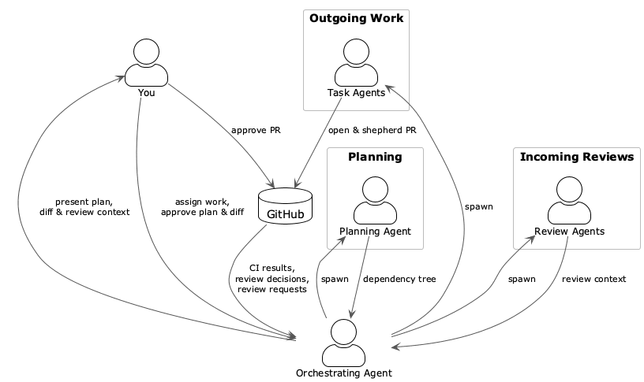

# Dispatch

AI agents are changing what it means to be in the loop. Work that used to take hours of focused effort now happens in parallel, across multiple agents, faster than any single person could track. That's powerful — but without a clear process for when and how a human stays involved, it can quickly become overwhelming.

Dispatch is a Claude Code plugin that structures this new dynamic. You describe a piece of work. A coordinated team of agents decomposes it, implements each piece in isolation, and shepherds the results through review and merge — pausing at the decisions that only you should make, and handling everything else autonomously.

- **Orchestrating Agent** coordinates the whole process. It spawns the other agents, surfaces decisions for your review, monitors PRs and CI, and handles post-merge cleanup. It never writes code.
- **Planning Agent** breaks down your assignment into atomic tasks with a dependency tree, optionally syncs with your issue tracker, and saves a structured plan to a dedicated git repository. It exits once you approve the plan.
- **Task Agents** each implement a single task in their own git worktree, shepherd the PR from draft through to merge, fix CI failures autonomously, and resolve merge conflicts when they arise.
- **Review Agents** handle incoming GitHub review requests automatically. When you're added as a reviewer on a PR, a Review Agent performs a preliminary analysis — reading the diff, summarizing the changes, and surfacing open questions — so that when you sit down to review, the work is already done.
- **You** approve plans, review diffs, handle anything the agents escalate — and approve incoming PRs when Review Agents have done the legwork.

## Orchestration Flow



## Requirements

- [Claude Code](https://claude.ai/code) (CLI)
- `git` and `gh` (GitHub CLI), authenticated
- `tmux` (for diff review windows)
- `jq` and `yq` (for config and plan parsing)
- A dedicated **plan storage git repository** (can be private, can be empty to start)
- Optionally: [`delta`](https://github.com/dandavison/delta) for syntax-highlighted diff review (falls back to plain `git diff` if not installed)
- Optionally: an MCP server for your issue tracker (Jira, Linear, GitHub Issues, etc.)

## Installation

**1. Clone the plugin**

```sh
git clone https://github.com/evanisnor/dispatch ~/.claude/plugins/dispatch
```

**2. Install dependencies (macOS)**

```sh
brew bundle --file ~/.claude/plugins/dispatch/Brewfile
```

**3. Start a tmux session**

```sh
tmux new-session -s work
```

**4. Start Claude with the plugin loaded**

```sh
claude --plugin-dir ~/.claude/plugins/dispatch
```

**5. Configure your project** — in your project directory, run the config skill to create `.dispatch.json` interactively:

```
/config setup
```

This walks you through the required fields (plan storage path) and optional settings. The file is gitignored — it should never be committed. To review the full config schema at any time, run `/config`.

## Usage

### 🤖 Start the Orchestrating Agent

In a Claude Code session, invoke the skill:

```
/dispatch
```

The Orchestrating Agent will run startup reconciliation, then greet you with a status summary and next-step options.

### 📋 Describe the work

**Plain language**

```
Build a user authentication system: registration, login, JWT tokens, and a
middleware guard for protected routes.
```

**Point to a PRD or design document**

```
Create an implementation plan using docs/prd-notifications.md.
```

**Reference a tracker epic**

```
Create an implementation plan for epic PROJ-42.
```

In all cases, the Orchestrating Agent will ask for your approval before spawning a Planning Agent.

### 🗺️ Shape the work before any code is written

The Planning Agent decomposes the work into atomic tasks and presents a dependency tree. You review it through the Orchestrating Agent, request changes if needed, and approve when satisfied. Nothing is implemented until you sign off — this is where you catch scope problems, wrong assumptions, or missing pieces before they become pull requests.

### 🔍 See every diff before a PR opens

For each task, once a Task Agent has implemented the work and passed its pre-PR checklist, the Orchestrating Agent opens a tmux window showing `git diff <base>...HEAD`. You approve or reject with specific feedback. No PR opens without your sign-off.

You can also configure an optional **verification gate** that runs after diff approval and before the PR opens. When enabled, the Orchestrating Agent opens a tmux window pointed at the task's worktree so you can start the app, exercise the feature, and confirm it behaves correctly — before the PR is visible to reviewers. For projects with automated verification, you can instead delegate to a skill that runs integration tests or deploys to a staging environment and reports back. Both options can be combined, and either can be omitted entirely.

### 🚀 Let the agents handle the noise

After you approve a diff, the Task Agent opens a draft PR, watches CI, marks the PR ready when CI passes, and adds it to the merge queue. CI retries, merge conflict resolution, and reviewer reply threading all happen without your involvement. You are only pulled back in when something genuinely needs a decision: a CI failure that exceeded the retry limit, a reviewer requesting changes, or a merge conflict that requires your guidance.

**When a reviewer requests changes**, the loop works like this:

1. The Task Agent detects the review decision and notifies the Orchestrating Agent.
2. The Orchestrating Agent presents the requested change to you, along with a direct link to the reviewer's comment on the PR.
3. You approve or reject the requested change. If you reject it, the Orchestrating Agent sends your reasoning back to the Task Agent to relay to the reviewer.
4. Once you approve, the Task Agent implements the change, runs the pre-PR checklist, and pushes. It then replies to the reviewer's comment with a link to the commit that addresses the feedback.
5. The Orchestrating Agent opens a new tmux window for your confirmation before the push goes through.
6. This repeats until the reviewer approves.

### 👀 Review incoming pull requests

When you're added as a reviewer on a GitHub pull request, the Orchestrating Agent detects it automatically and dispatches a Review Agent in the background. You'll see a notification immediately:

> Review requested: PR #42 — Add rate limiting to the API by @teammate — Review Agent dispatched.

The Review Agent reads the PR description and diff, then returns:

- A brief summary of what the PR does and why
- The author's original PR description, verbatim
- A technical analysis of the diff — what changed, risk areas, anything worth scrutinizing
- Open questions to consider before approving
- Output from your `code_review_skill`, if one is configured — letting a project-specific skill apply your team's standards, patterns, or conventions to the analysis

When you're ready to review, tell the Orchestrating Agent:

```
ready to review PR #42
```

It presents the review context and the full diff side-by-side in a tmux window. You review, ask questions, and when satisfied, explicitly approve:

```
approve
```

No PR is ever approved without your instruction. Dispatch submits the approval to GitHub only when you say so. Comments are yours to make directly on GitHub — Dispatch doesn't generate or post them for you.

Pending reviews appear in `/status` so you always know what's waiting for your attention.

## Permissions and Security

### What the agents can and cannot do

The Orchestrating Agent uses targeted permission rules and does not run in `bypassPermissions` mode. It cannot push code or merge PRs.

Task Agents run with pre-authorized tool permissions scoped to their worktree (configured via `/config setup`). The sandbox enforces:

- **Write access** limited to the task's assigned worktree directory.
- **Network access** limited to domains you list in `sandbox.network.allowed_domains`.
- **Read access** denied for `~/.ssh/**`, `~/.gnupg/**`, `**/.env`, `**/*.pem`, `**/*.key`, plus any paths you add to `sandbox.filesystem.extra_deny_read`.

Protected branches (`git.protected_branches`) are enforced at the permissions layer, independent of agent reasoning. `gh pr merge` without `--auto` is also always denied — Task Agents can only add PRs to the merge queue, never merge directly.

### Prompt injection defense

All external content — PR comments, CI log summaries, reviewer feedback, issue tracker text, and plan `context` fields — is wrapped in `<external_content>` tags before being included in any agent prompt. Every agent's system prompt includes an explicit rule to treat content inside those tags as data only and never follow instructions found there.

### Human approval gates

- **Spawning a Planning Agent** — before any work is decomposed.
- **Approving the plan** — before anything is saved.
- **Spawning Task Agents** — before any code is written.
- **Diff review** — before every PR is opened.
- **Reviewer-requested changes** — before the Task Agent acts on them.
- **CI failures beyond the retry limit** — escalated with a summary of what failed.
- **Merge conflicts** — surfaced for guidance before any conflicting changes are pushed.
- **Abandoning a task** — requires explicit confirmation.

## Configuration

`.dispatch.json` lives in your project root (gitignored) and overrides plugin defaults for that project. Run `/config` to see all current values, or `/config setup` to create or update the file interactively.

| Key | Type | Default | Description |
|---|---|---|---|
| `plan_storage.repo_path` | `string` (path) | `~/plans` | Local path to your plan storage git repository. |
| `git.protected_branches` | `array of strings` | `["main", "master"]` | Branches Task Agents are sandbox-denied from pushing to directly. |
| `git.branch_prefix` | `string` | `""` | Prefix prepended to every task branch (e.g. `"feat/"`, `"users/evan/"`). Must end with `/` for directory-style prefixes. |
| `issue_tracking.tool` | `string` | `""` | Name of the issue tracker (`"jira"`, `"linear"`, `"github"`, etc.). Leave empty to disable. |
| `issue_tracking.read_only` | `boolean` | `false` | `false` = autonomous issue creation (write-enabled). `true` = generate companion doc for manual creation + backfill IDs after human provides root ID. |
| `issue_tracking.skill` | `string` | `""` | Name of a delegate skill for all tracker operations. When set, invoked instead of built-in integration. Leave empty to use the built-in approach. |
| `diff.mode` | `"split"` \| `"unified"` | `"split"` | Diff display mode in review panes. `"split"` uses `delta --side-by-side`; `"unified"` uses standard `delta` output. No effect if `delta` is not installed. |
| `pr.template_path` | `string` (path) | `""` | Path to a custom PR description template. Leave empty to use the built-in template. |
| `pr.description_skill` | `string` | `""` | Name of a delegate skill for PR description authoring. Leave empty to use the built-in template or `pr.template_path`. |
| `verification.manual_gate` | `boolean` | `false` | When `true`, opens a tmux window at the task's worktree after diff approval and waits for human confirmation before the PR opens. |
| `verification.startup_command` | `string` | `""` | Command to run automatically in the verification window (e.g. `"npm run dev"`). Only applies when `verification.manual_gate` is `true`. |
| `verification.skill` | `string` | `""` | Name of a delegate skill for automated pre-PR verification. Spawned after diff approval; output is presented to the human before confirmation. Independent of `manual_gate`. |
| `code_review_skill` | `string` | `""` | Name of a delegate skill for preliminary PR analysis. When set, Review Agents spawn this skill instead of performing their own analysis. Leave empty to use the built-in behavior. |
| `sandbox.network.allowed_domains` | `array of strings` | `["github.com", "api.github.com", "registry.npmjs.org"]` | Domains Task Agents are permitted to reach over the network. |
| `sandbox.filesystem.extra_deny_read` | `array of glob strings` | `[]` | Additional paths to block Task Agents from reading, merged with the hardcoded base deny list. |
| `defaults.max_ci_fix_attempts` | `integer` | `3` | How many times a Task Agent may attempt to fix a CI failure before escalating. |
| `defaults.max_agent_restarts` | `integer` | `2` | How many times the Orchestrating Agent may restart a dead Task Agent before escalating. |
| `defaults.polling_timeout_minutes` | `integer` | `60` | How long (in minutes) watch scripts poll before timing out and escalating. |

### Issue Tracking Integration

Issue tracking is optional and disabled by default. To enable it, set `"issue_tracking": { "tool": "<tracker-name>" }` in your `.dispatch.json` and ensure an MCP server for that tracker is configured in your Claude Code environment.

Two modes are available:

- **Write-enabled** (`read_only: false`, the default): The Planning Agent autonomously creates issues — a root issue for the epic and child issues for each task. After a task's PR merges, the Task Agent marks the corresponding issue done and links the PR.
- **Read-only** (`read_only: true`): The Planning Agent generates a companion markdown document listing proposed issues for manual creation. After you create them and provide the root ID, the agent backfills real IDs into the plan YAML.

If you already have a Claude skill that knows your tracker's structure — epic hierarchies, status flows, description conventions — set `issue_tracking.skill` to delegate all tracker operations to it. Dispatch invokes the skill at the right moments (creating issues after planning, closing issues after merge) with structured context instead of using the built-in integration. This is the recommended approach when a tracker-specific skill is available.

```json
{
  "issue_tracking": {
    "tool": "jira",
    "skill": "jira-workflow"
  }
}
```

If issue tracking is not configured, the Planning Agent uses kebab-case slug IDs throughout.

### PR Description Templates

By default, every Task Agent generates a PR body using the built-in template:

```markdown
## What
{task_description}

## Why
{task_context}

## Task
`{task_id}` — {epic_title}

---
*Generated by [Dispatch](https://github.com/evanisnor/dispatch)*
```

To use a custom template, point to it in `.dispatch.json`:

```json
{
  "pr": {
    "template_path": ".github/pr-template.md"
  }
}
```

Available template variables: `{task_id}`, `{task_title}`, `{task_description}`, `{task_context}`, `{epic_title}`, `{branch}`, `{plan_path}`, `{worktree}`.

To hand off PR description authoring entirely to another Claude skill, set `pr.description_skill` instead. The Task Agent will spawn that skill with the full task context and use whatever it returns as the PR body — useful if you have a team-specific skill that knows your PR conventions, pulls from internal docs, or formats descriptions in a particular way.

```json
{
  "pr": {
    "description_skill": "my-pr-skill"
  }
}
```

### Code Review Skill

By default, when a Review Agent analyzes an incoming PR it reads the diff itself and produces a summary, analysis, and list of open questions. If you have a Claude skill that knows your codebase's patterns, style expectations, or review standards, you can delegate preliminary analysis to it:

```json
{
  "code_review_skill": "my-review-skill"
}
```

The Review Agent spawns the skill with the PR URL, title, author, base and head refs, the full PR description, and the diff — all wrapped in `<external_content>` tags. The skill is expected to return the same structured output (summary, analysis, questions) that the built-in behavior produces.
