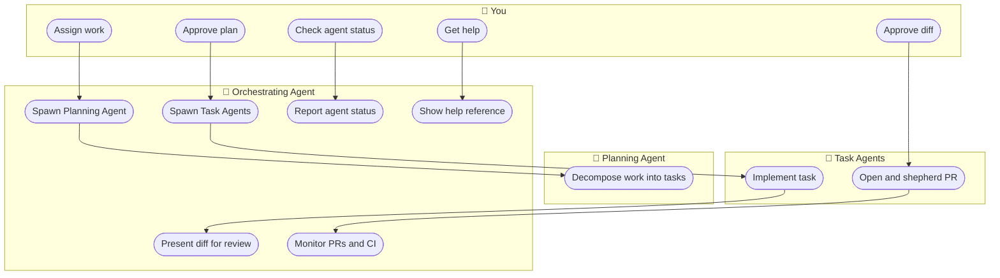

# agent-workflow

agent-workflow is a Claude Code plugin that runs a multi-agent software development workflow directly from your terminal. You describe a piece of work, and a coordinated team of AI agents handles the rest: decomposing the work into atomic tasks, implementing each one in an isolated git worktree, opening pull requests, watching CI, responding to reviewer feedback, and merging — while keeping you in the loop at every decision point that matters.

- **Orchestrating Agent** coordinates the whole process. It spawns the other agents, opens tmux panes for diff review, monitors PRs and CI, and handles post-merge cleanup. It never writes code.
- **Planning Agent** breaks down your assignment into atomic tasks with a dependency tree, optionally syncs with Jira, and saves a structured plan to a dedicated git repository. It exits once you approve the plan.
- **Task Agents** each implement a single task in their own git worktree, shepherd the PR from draft through to merge, fix CI failures autonomously, and resolve merge conflicts when they arise.
- **You** approve plans, review diffs, and handle anything the agents escalate — no more, no less.

## Orchestration Flow



## Requirements

- [Claude Code](https://claude.ai/code) (CLI)
- `git` and `gh` (GitHub CLI), authenticated
- `tmux` (for diff review panes)
- `jq` and `yq` (for config and plan parsing)
- A dedicated **plan storage git repository** (can be private, can be empty to start)
- Optionally: [`delta`](https://github.com/dandavison/delta) for syntax-highlighted diff review panes (falls back to plain `git diff` if not installed)
- Optionally: a Jira MCP server if you want Jira integration

## Installation

```sh
# 1. Clone the plugin
git clone https://github.com/evanisnor/agent-workflow ~/.claude/plugins/agent-workflow

# 2. Install dependencies (macOS)
brew bundle --file ~/.claude/plugins/agent-workflow/Brewfile

# 3. Start a tmux session (diff review splits panes in the current window)
tmux new-session -s work

# 4. Start Claude with the plugin loaded
claude --plugin-dir ~/.claude/plugins/agent-workflow
```

**5. Configure your project** — in your project directory, run the config skill to create `.agent-workflow.json` interactively:

```
/agent-workflow:config setup
```

This walks you through the required fields (plan storage path, worktree directory) and optional settings. The file is gitignored — it should never be committed. To review the full config schema at any time, run `/agent-workflow:config`.

## Usage

### 🤖 Start the Orchestrating Agent

In a Claude Code session, invoke the skill:

```
/agent-workflow:orchestrating-agents
```

The Orchestrating Agent activates automatically if you have `settings.json` installed as a plugin default. It will run startup reconciliation, then greet you with a status summary and next-step options.

### 📋 Give it an assignment

Assignments can take several forms — plain language, references to existing documents, or Jira tickets.

**Plain language**

```
Build a user authentication system: registration, login, JWT tokens, and a
middleware guard for protected routes.
```

**Point to a PRD or design document**

```
Create an implementation plan using docs/prd-notifications.md.
```

The Planning Agent will read the document and decompose it into tasks. You can also paste content directly into the prompt if you prefer not to reference a file.

**Reference a Jira epic**

```
Create an implementation plan for epic PROJ-42.
```

The Planning Agent reads the epic and its child issues via the Jira MCP server, builds a plan keyed to the real ticket IDs, and keeps them in sync as work progresses.

In all cases, the Orchestrating Agent will ask for your approval before spawning a Planning Agent.

### 🗺️ Review and approve the plan

The Planning Agent decomposes the work and presents a dependency tree. You review it through the Orchestrating Agent, request changes if needed, and approve when satisfied. The plan is saved to your plan storage repo.

### 🔍 Review diffs before PRs open

For each task, once a Task Agent has implemented the work and passed its pre-PR checklist, the Orchestrating Agent opens a tmux window showing `git diff HEAD`. You approve or reject with specific feedback. No PR opens without your sign-off.

### 🚀 Monitor and merge

After you approve a diff, the Task Agent opens a draft PR, watches CI, marks the PR ready when CI passes, and adds it to the merge queue. You are notified of CI failures that exceed the retry limit, reviewer change requests, and merge queue issues. Everything else is handled automatically.

**When a reviewer requests changes**, the loop works like this:

1. The Task Agent detects the review decision and notifies the Orchestrating Agent.
2. The Orchestrating Agent presents the requested change to you, along with a direct link to the reviewer's comment on the PR so you can respond to them directly if needed.
3. You approve or reject the requested change. If you reject it, the Orchestrating Agent sends your reasoning back to the Task Agent to relay to the reviewer.
4. Once you approve, the Task Agent implements the change, runs the pre-PR checklist, and pushes. It then replies to the reviewer's comment with a link to the commit that addresses the feedback.
5. The Orchestrating Agent opens a new tmux diff pane for your confirmation before the push goes through.
6. This repeats until the reviewer approves.

## Permissions and Security

### What the agents can and cannot do

The Orchestrating Agent uses targeted permission rules and does not run in `bypassPermissions` mode. It cannot push code or merge PRs.

Task Agents run in `bypassPermissions` mode, but this is scoped inside an OS-level sandbox (Seatbelt on macOS, bubblewrap on Linux) at spawn time. The sandbox is generated from your `.agent-workflow.json` and enforces:

- **Write access** limited to the task's assigned worktree directory.
- **Network access** limited to domains you list in `sandbox.network.allowed_domains`.
- **Read access** denied for `~/.ssh/**`, `~/.gnupg/**`, `**/.env`, `**/*.pem`, `**/*.key`, plus any paths you add to `sandbox.filesystem.extra_deny_read`.

Protected branches (`git.protected_branches`) are enforced by deny rules at the permissions layer, independent of agent reasoning. `gh pr merge` without `--auto` is also always denied — Task Agents can only add PRs to the merge queue, never merge directly.

### Prompt injection defense

All external content — PR comments, CI log summaries, reviewer feedback, Jira text, and plan `context` fields — is wrapped in `<external_content>` tags before being included in any agent prompt. Every agent's system prompt includes an explicit rule to treat content inside those tags as data only and never follow instructions found there.

CI scripts (`watch-ci.sh`, `watch-merge-queue.sh`, `watch-pr-status.sh`) emit state-change summaries only. Raw log text and full API payloads are never injected into agent context.

### Human approval gates

The agents handle routine work autonomously, but every decision that materially affects the codebase or project state requires your explicit sign-off. Here is where you are always in the loop:

**Spawning a Planning Agent** — before any work is decomposed, the Orchestrating Agent asks for your approval. You can provide context, adjust scope, or decline.

**Approving the plan** — the Planning Agent presents the full dependency tree to you via the Orchestrating Agent before anything is saved. You can request changes and iterate until the plan reflects your intent.

**Spawning Task Agents** — before any code is written, the Orchestrating Agent presents the batch of tasks it intends to start and asks for your go-ahead. You can hold back specific tasks or adjust the batch.

**Diff review before a PR opens** — every Task Agent must have its diff reviewed and approved by you before a draft PR is created. The Orchestrating Agent opens a tmux window showing the full `git diff HEAD`. No PR is opened without your sign-off, and you can reject with specific feedback that gets forwarded to the Task Agent.

**Reviewer-requested changes** — when a PR reviewer asks for changes, the Orchestrating Agent presents the request to you before the Task Agent acts on it. You decide whether to approve the requested change or push back on the reviewer. A second diff review happens before the updated code is pushed.

**CI failures beyond the retry limit** — Task Agents fix CI failures autonomously up to a configurable limit (default: 3 attempts). If the limit is exceeded, the Orchestrating Agent escalates to you with a summary of what failed and what was tried.

**Merge conflicts** — if a rebase or merge queue conflict cannot be resolved cleanly, the Orchestrating Agent surfaces it to you for guidance before any conflicting changes are pushed.

**Abandoning a task** — marking a task cancelled and unblocking or re-planning its dependents requires your approval.

## Jira Integration

Jira integration is optional and disabled by default. To enable it, set `"jira": { "enabled": true }` in your `.agent-workflow.json` and ensure a Jira MCP server is configured and accessible to Claude Code.

When enabled, the Planning Agent reads epics and child issues via the Jira MCP server (read-only). It matches Jira issues to plan tasks by title similarity and backfills real Jira keys into the plan YAML in place of slug IDs.

If Jira is disabled or the MCP server is unavailable, the Planning Agent uses kebab-case slug IDs (`feature-user-auth`, `task-login-endpoint`) and generates a companion markdown document (`{slug}-jira-items.md`) in the plan storage repo. This document contains a formatted table of proposed issues that you can use to create tickets manually in Jira or any other tracker.

The plugin does not ship a Jira MCP server configuration. If you need one, configure it separately in your Claude Code settings before enabling Jira integration here.

## PR Description Templates

By default, every Task Agent generates a PR body using the built-in template:

```markdown
## What
{task_description}

## Why
Part of epic: {epic_title}

## Task
- ID: {task_id}
- Branch: {branch}
- Plan: {plan_path}

---
*Generated by [agent-workflow](https://github.com/evanisnor/agent-workflow)*
```

To use a custom template, create a markdown file in your project and point to it in `.agent-workflow.json`:

```json
{
  "pr": {
    "template_path": ".github/pr-template.md"
  }
}
```

Any of the following variables can be used in the template and will be interpolated at PR creation time:

| Variable | Value |
|---|---|
| `{task_id}` | Task ID from the plan YAML |
| `{task_title}` | Task title from the plan YAML |
| `{task_description}` | Task description from the plan YAML |
| `{epic_title}` | Epic title from the plan YAML |
| `{branch}` | Feature branch name |
| `{plan_path}` | Path to the plan YAML file |
| `{worktree}` | Absolute path to the task's git worktree |
