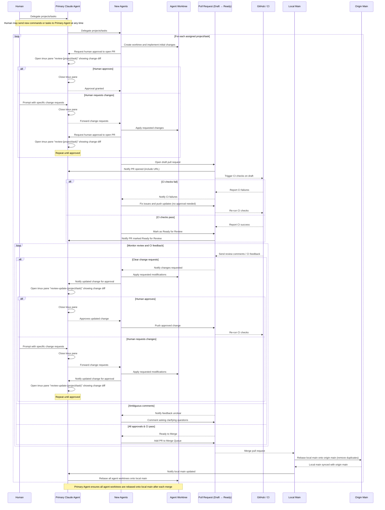

# Agent Workflow

```mermaid
sequenceDiagram
    participant Human as Human
    participant PrimaryAgent as Primary Claude Agent
    participant NewAgent as New Agents
    participant Worktree as Agent Worktree
    participant PR as Pull Request (Draft → Ready)
    participant GitHubCI as GitHub / CI
    participant LocalMain as Local Main
    participant OriginMain as Origin Main

    Human->>PrimaryAgent: Delegate projects/tasks
    Note over Human,PrimaryAgent: Human may send new commands or tasks to Primary Agent at any time
    PrimaryAgent->>NewAgent: Delegate projects/tasks
    loop For each assigned project/task
        NewAgent->>Worktree: Create worktree and implement initial changes
        NewAgent->>PrimaryAgent: Request human approval to open PR
        PrimaryAgent->>PrimaryAgent: Open tmux pane "review-{project/task}" showing change diff
        alt Human approves
            PrimaryAgent->>PrimaryAgent: Close tmux pane
            PrimaryAgent-->>NewAgent: Approval granted
        else Human requests changes
            Human->>PrimaryAgent: Prompt with specific change requests
            PrimaryAgent->>PrimaryAgent: Close tmux pane
            PrimaryAgent-->>NewAgent: Forward change requests
            NewAgent->>Worktree: Apply requested changes
            NewAgent->>PrimaryAgent: Request human approval to open PR
            PrimaryAgent->>PrimaryAgent: Open tmux pane "review-{project/task}" showing change diff
            Note over PrimaryAgent: Repeat until approved
        end
        NewAgent->>PR: Open draft pull request
        PR->>PrimaryAgent: Notify PR opened (include URL)
        PR-->>GitHubCI: Trigger CI checks on draft

        alt CI checks fail
            GitHubCI-->>PR: Report CI failures
            PR-->>NewAgent: Notify CI failures
            NewAgent->>PR: Fix issues and push updates (no approval needed)
            PR-->>GitHubCI: Re-run CI checks
        else CI checks pass
            GitHubCI-->>PR: Report CI success
            NewAgent->>PR: Mark as Ready for Review
            PR->>PrimaryAgent: Notify PR marked Ready for Review
        end

        loop Monitor review and CI feedback
            GitHubCI-->>PR: Send review comments / CI feedback
            alt Clear change requests
                PR-->>NewAgent: Notify changes requested
                NewAgent->>Worktree: Apply requested modifications
                NewAgent->>PrimaryAgent: Notify updated change for approval
                PrimaryAgent->>PrimaryAgent: Open tmux pane "review-update-{project/task}" showing change diff
                alt Human approves
                    PrimaryAgent->>PrimaryAgent: Close tmux pane
                    PrimaryAgent-->>NewAgent: Approves updated change
                    NewAgent->>PR: Push approved change
                    PR-->>GitHubCI: Re-run CI checks
                else Human requests changes
                    Human->>PrimaryAgent: Prompt with specific change requests
                    PrimaryAgent->>PrimaryAgent: Close tmux pane
                    PrimaryAgent-->>NewAgent: Forward change requests
                    NewAgent->>Worktree: Apply requested modifications
                    NewAgent->>PrimaryAgent: Notify updated change for approval
                    PrimaryAgent->>PrimaryAgent: Open tmux pane "review-update-{project/task}" showing change diff
                    Note over PrimaryAgent: Repeat until approved
                end
            else Ambiguous comments
                PR-->>NewAgent: Notify feedback unclear
                NewAgent->>PR: Comment asking clarifying questions
            else All approvals & CI pass
                PR-->>NewAgent: Ready to Merge
                NewAgent->>PR: Add PR to Merge Queue
            end
        end

        PR-->>LocalMain: Merge pull request
        LocalMain->>OriginMain: Rebase local main onto origin main (remove duplicates)
        OriginMain-->>LocalMain: Local main synced with origin main
        LocalMain->>PrimaryAgent: Notify local main updated
        PrimaryAgent->>Worktree: Rebase all agent worktrees onto local main
    end

    Note over PrimaryAgent,Worktree: Primary Agent ensures all agent worktrees are rebased onto local main after each merge
```
